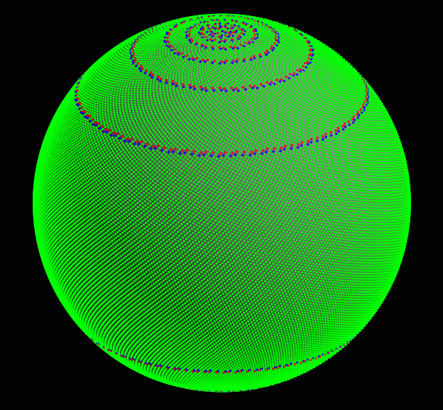
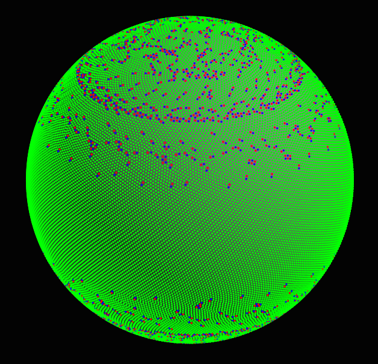
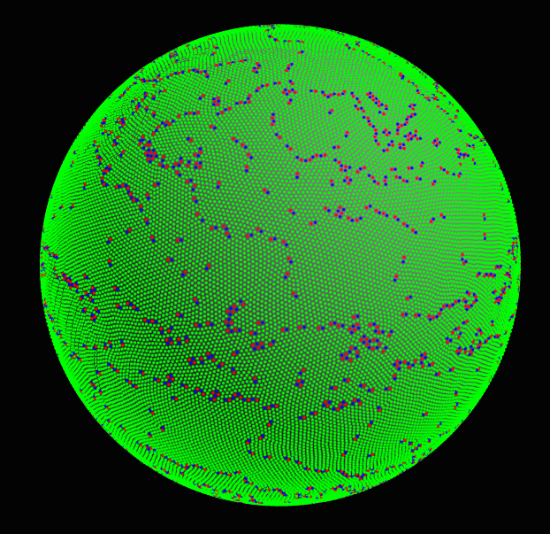
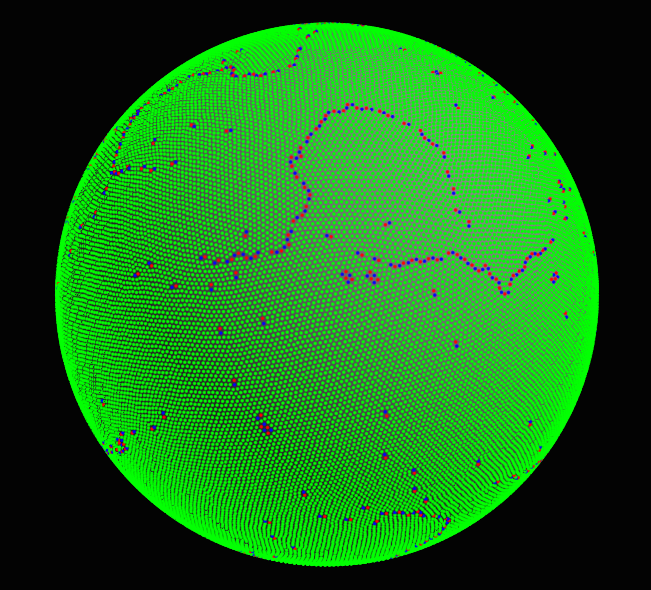
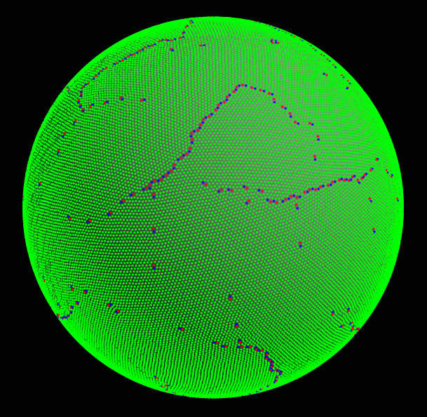
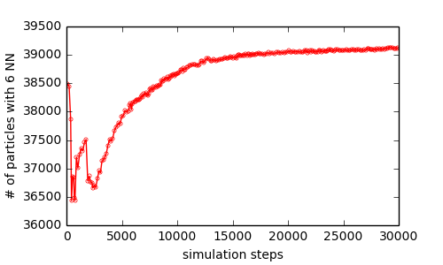
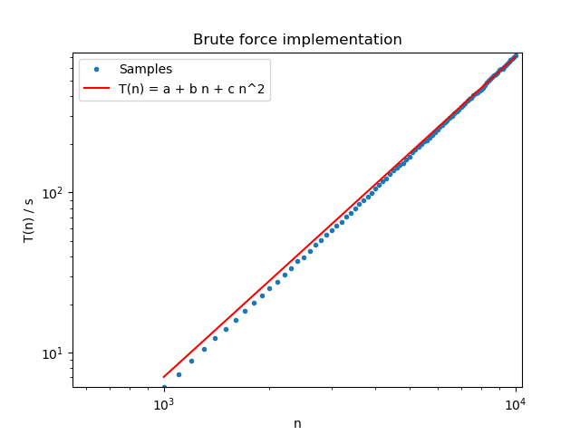
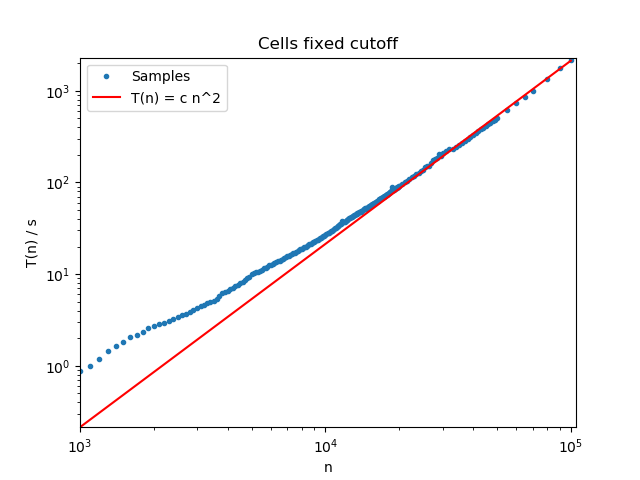
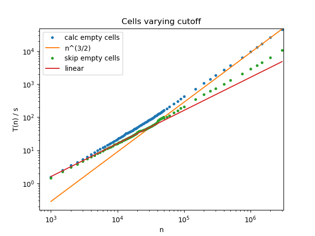

# Molecular Dynamics Simulation on a Sphere

Tim Scheffler, 2015 - 2019

This is a Python/C project to demonstrate molecular dynamics 
simulation on a sphere. The particles interact via a cutoff Coulomb potential.
A damping force proportional to the relative velocities of interacting
particles will be used to dissipate energy and to cool down the system in
order to approach a configuration of minimal energy. This ground state
should then give the optimal packing of N particles on a sphere. 

##  Dependencies

* Python 3.x
* A C-Compiler
* SciPy
* PyOpenGL

Tested on Kubuntu 18.04 with Python 3.7.3. Intel Core i5-6600 @ 3.30GHz and
macOS Big Sur, (anaconda) python 3.8.5.  
(For running on Windows you might need `freeglut`)

## Building

Use the following command to build the C-extension:

`$ python setup.py build_ext -i`

## Usage

Start the GUI simulation with 

`$ python run_davis_clib.py`

Parameters (like e.g. number of particles or the number of used CPU cores) 
are setup as global variables at the top of `run_davis_clib.py`.

With focused OpenGL window you can drag the mouse (while clicking)
to rotate the sphere. Use the following keys to control the simulation:

* "g": start/pause the simulation
* "q": quit

Please be aware, that there is no error handling in the C part. If something bad
happens, like malloc can not get enough memory or there is a negative 
argument for the `sqrt` function, the program crashes hard.  In that case
try a simulation with less particles or smaller time step.

## Simulation technique

This is a molecular dynamics simulation using
the _velocity verlet algorithm_[1] for time integration. We make the
lookup of interacting particles more efficient with a _linked list cell algorithm_[1]. Keeping
the particles constrained to the surface of the sphere is done via
the _RATTLE algorithm_[2], which can be solved analytically for this simple constraint.

The simulation is purely three-dimensional: all particles have 3d vectors
for position, velocity and acceleration. In principle, as the particles
are constrained to the surface of the sphere, the system is two-dimensional,
but simulating the two-dimensional manifold is more complicated[3] than just
using the embedding three-dimensional space for simulation. Doing so
we can also use the simple 3d linked cell algorithm for neighbour lookup, although
most of the 3d cells will be empty. Additionally, 
we could use this code for simulation of other constraining surfaces.

The particle interaction is a cutoff Coulomb potential of the form: 

    V(r) = 1/r + r/r_c^2 - 2/r_c   for r < r_c
           0                       otherwise

where `r` is the distance between interacting particles and `r_c`
is the cutoff-distance. The coulomb force is three-dimensional, meaning
`r` is just the euclidean distance `r = sqrt(dx^2 + dy^2 + dz^2)` between
two particles.

The forces between the particles are always repelling, but this is 
not a problem as the system is confined to the surface of the sphere.
In the ground state the overall distance of the particles would reach
a maximum. This would yield in a flat geometry a perfect hexagonal lattice,
meaning that each particle would have exactly six nearest neighbours.

In a non-flat two-dimensional space, like the surface of the sphere, a 
perfect hexagonal lattice cannot be established and there are particles
with more or less than six nearest neighbours. (See: _Euler Poincaré_ relation.)

During the simulation we will observe a system cooling down and 
(hopefully) approaching the ground state. In order to measure the 
development we will count the number of particles, that have exactly six neighbours.
For this we use the [qhull](http://www.qhull.org/) implementation from 
[scipy](http://docs.scipy.org/doc/scipy/reference/generated/scipy.spatial.ConvexHull.html#scipy.spatial.ConvexHull). 

In the OpenGL window all particles having six neighbours are coloured **green**, 
particles having less than six neighbours are coloured **blue**, more than six **red**.

Additionally we will draw a yellow circle with the radius r_c around one 
particle. This is just a visual aid to judge the cutoff radius. The 
center particle for this "cutoff sphere" is arbitrarily choosen to be
N/2.

For the initial configuration it is important, that the particles are not
too close, because the Coulomb potential can become so large, that the
simulation gets unstable. Therefore we use the method of [Fibonacci spheres](https://stackoverflow.com/questions/9600801/evenly-distributing-n-points-on-a-sphere/26127012#26127012) for a good first configuration.

For more information about Coulomb particles on curved surfaces, please see
the talk by Paul Chaikin ["Classical Wigner Crystals on flat and curved surfaces"](https://www.youtube.com/watch?v=Wko67TCla74).

## External sources

The basis for the OpenGL visualisation is taken from ["Adventures in OpenCL"](https://github.com/enjalot/adventures_in_opencl/tree/master/python/part2) tutorial series by Ian Johnson. 

## License

MIT license

Copyright(c) 2015 - 2019 Tim Scheffler

Some of the code is
taken from other sources, and there should be a link to the original source.

## Example Simulation

(These pictures were taken from a version of the visualisation in which
the yellow "cutoff sphere" visual aid had not yet been implemented.)

We have N = 40000 particles.

Initial configuration after placing 40000 particles with the 
[Fibonacci spheres](https://stackoverflow.com/questions/9600801/evenly-distributing-n-points-on-a-sphere/26127012#26127012) method:

(Particles having six neighbours are coloured **green**, 
particles having less than six neighbours are coloured **blue**, more than six **red**.)

After 660 simulation steps. The global structure of the initial configuration breaks apart:

After 2317 simulation steps:

After 13020 simulation steps:

Configuration after 29918 simulation steps:

After comparison of the last two configurations one sees, that the
number of single islands is reduced and the strings become more flat.
Strings ("scars") like these are discussed in the talk by 
[Paul Chaikin](https://www.youtube.com/watch?v=Wko67TCla74).

If we now plot the development of the number of particles with 
six nearest neighbours against time, we get the following plot

Here we see, that initially after placing the particles with the 
Fibonacci spheres method the distribution is already quite good. After
starting the dynamics the global structure from the Fibonacci spheres is 
destroyed and we temporarily get a configuration with worse NN (Nearest Neighbour) 
distribution. But after that, the system slowly approaches the optimal configuration
as it cools down. Hereby the approach to the ground state gets slower and slower.

## Time complexity

In the following we will take a look at how the linked cell algorithm
influences the time complexity of the simulation.

### Brute force implementation

The Python class `BruteForceWorld` does not use the linked cell optimisation and
calculates all particle-particle interactions during
the force calculation sub-step. This means the time complexity scales with O(n^2).
The `dvs_advance` and `dvs_correct` scale with O(n) and for the general infrastructure
of the code we expect a O(1) behaviour. So, in the end we expect the runtime T(n) for n particles
to be 

    T(n) = a + b n + c n^2

    with a, b, c >= 0

The following log-log plot shows the time complexity for 7500 time steps and 
varying particle numbers n. The time is given in seconds.

The fitted curve is a = 7e-18, b = 2e-17, c = 7e-6, basically, just the quadratic term. 
The fit was made using `scipy.optimize.curve_fit` and constraining the parameters to >= 0
(without the constrain we might get negative parameters for the smaller polynomial terms,
but this would make no sense as the above mentioend O(1) and O(n) parts of the simulation
must increase the running time.)

The plot only covers one decade in the n log scale, because the running times were becoming 
quite long and I was impatient. One sees, that the time complexity, at least for larger n, 
is approximated quite nicely by O(n^2), as expected.

### Cell implementation with fixed cutoff

In order to make the simulation more efficient if the interaction can be limited
to a fixed range, we use the [linked cell algorithm](https://en.wikipedia.org/wiki/Cell_lists).
As described above, we modify the original Coulomb interaction such that the
force is cut-off at a given distance r_c.

Using the linked cell algorithm we get the following running times:

As one can see, the timing is way better compared to the naive "brute force" implementation above. For example,
in the brute force version the running time for a system of n = 10000 particles was T(n=10000) = 718s. 
In the cell version we get T(n=10000) = 27s.

But, as the cutoff distance is kept constant, in this case r_c = 0.1, the number of cells for
the system is also constant. The force calculation however is cell-based, which means roughly,
that for all particles inside a cell n_c we must calculate O(n_c ^ 2) interactions.
For the fixed cutoff, however, n_c is proportional to n and therefore we see in the log-log 
plot the O(n^2) behaviour for large n.

### Cell implementation with varying cutoff

Here we vary the cutoff in the following way:

    cutoff = math.sqrt( 4*math.pi / n ) * 2.5

This is because we expect the particles to be distributed evenly on the surface
of the sphere (4&#960;), therefore the average area on the sphere for one
particle is just 4&#960;/n and the radius of this area is just its 
square root. We use this radius as the basis for the 3d cutoff although this
radius is calculated on the 2d surface of the sphere. But as the particle
number increases, the area inside the cutoff distance becomes more and more flat.
So we expect, for large n, that the number of particles inside the cutoff
distance around one particle stays constant, if we vary the cutoff for
n following this formula.

So we can assume, that the time complexity (for the force calculation, which takes
most of the calculation time) per _occupied_ cell stays constant O(1). As 
binning of the cells scales with 1/r_c in each dimension, which is n^(1/2).
Given the spherical constraint only the cells, which contain parts of the surface of the
sphere, will be populated by particles, the majority of cells will be empty.
This surface is two-dimensional and the number of cells will scale with (1/r_c)^2.
Therefore, we expect an overall time complexity of O(1 * (n^(1/2))^2) = O(n).

As one can see, the samples belonging to the **green** dots follow O(n) for small n, but 
as the number of particles, n, gets larger the complexity is larger than O(n).
This is because the number of cells scales with (1/cutoff)^3 = n^(3/2). And as
the number of cells increases more and more time is spent just for running through
all the cells. This even more clearly seen for the **blue** dots, which belong to 
a sample run with a different C-lib: In this C-lib the line

    if (cells->cells[this_cell] == -1) continue;  // empty main cell

in the davis.c file had not yet been added, so here we run all the following code (including looking up
all neighbour cells) even if the main cell is empty. This increases the overall running
time compared to the corrected version (green dots) and also introduces the O(n^(3/2)) 
behaviour for much lower n, as one can see.
 

### Remark

For the time complexity measurements I only used the single-threaded versions
of the algorithms, as the multi-threaded versions introduced some additional 
periodic features in the n-dependencies, which seem to be of purely technical origin.

## TensorFlow Implementation

The files `davis_tf.py` and `run_davis_tf.py` contain an experimental TensorFLow
implementation of the MD-part. For a start, I just tried to re-create the 
`BruteForceWorld` C-lib version of the MD-integration, which means at every
timestep *all* O(n^2) particle-particle interactions will be calculated.

For n = 1000 particles the TensorFlow version runs on the CPU at 
approx. 100 steps / 2s. I chose to use the CPU instead of the GPU in order
to compare the performance to the C-lib version of Davis: using the
same number of particles, the C-lib version runs at approx. 2100 steps / 2s.

I am not an expert in TensorFlow and so my TF implementation of the MD-integration
might be too naive or maybe TF is just not suited well for this kind of problem.
There surely is some room for optimisation in the TF implementation, for example:
in the TF we calculate the sqrt for the `i > j` and `i < j` direction of a pair.
In the C-lib however only the `i < j` direction is used. But this slight improvement
would surely not help in the 20x performance lag of the TF-version.

I tried various adjustments in the TF-version, but I could not manage to improve
the performance anywhere near to the performance of the C-lib, so after some
time I gave up on this.

## References

[1]: M.P. Allen, D.J. Tildesley,
_"Computer Simulation of Liquids"_,
(Oxford Scientific Publications, 1987)

[2]: H.C. Andersen, 
_"Rattle: A 'Velocity' Version of the Shake Algorithm for Molecular Dynamics Calculations"_,
Journal of Computational Physics **52**, (1983) 24

[3]: See for example the appendix A of J.-P. Vest, G. Tarjus, P. Viot,
_"Dynamics of a monodisperse Lennard-Jones system on a sphere"_,
arXiv:1401.7168v1 [cond-mat.stat-mech]
